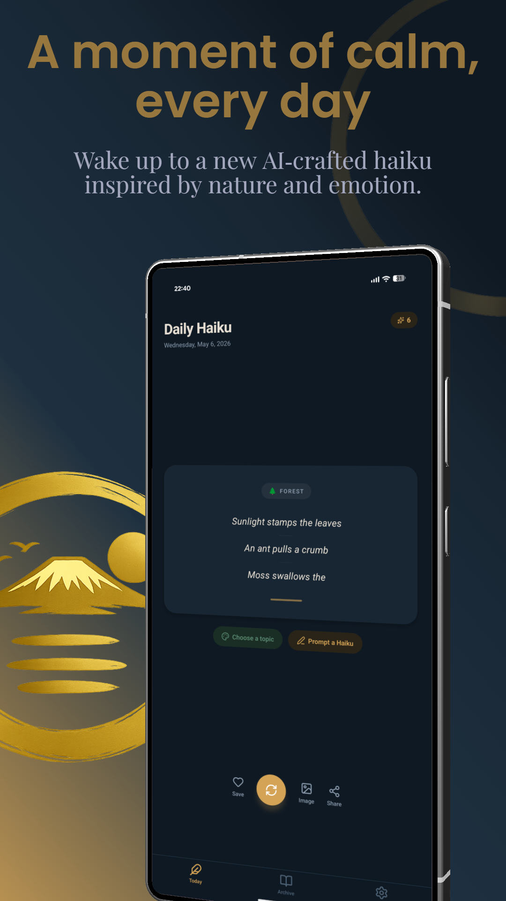
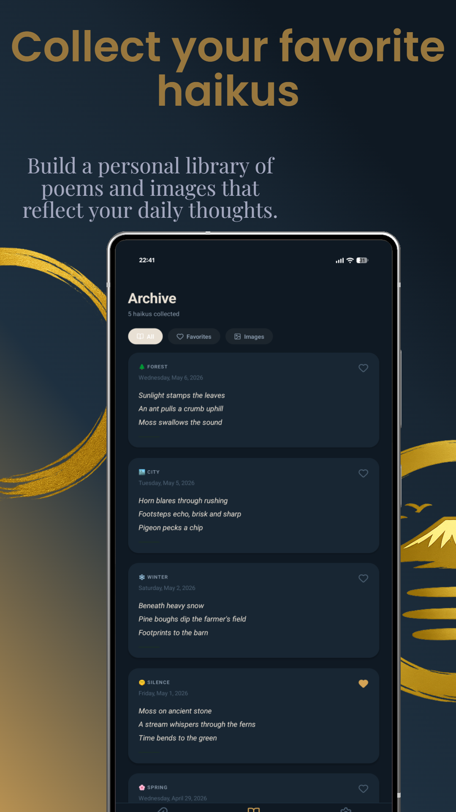
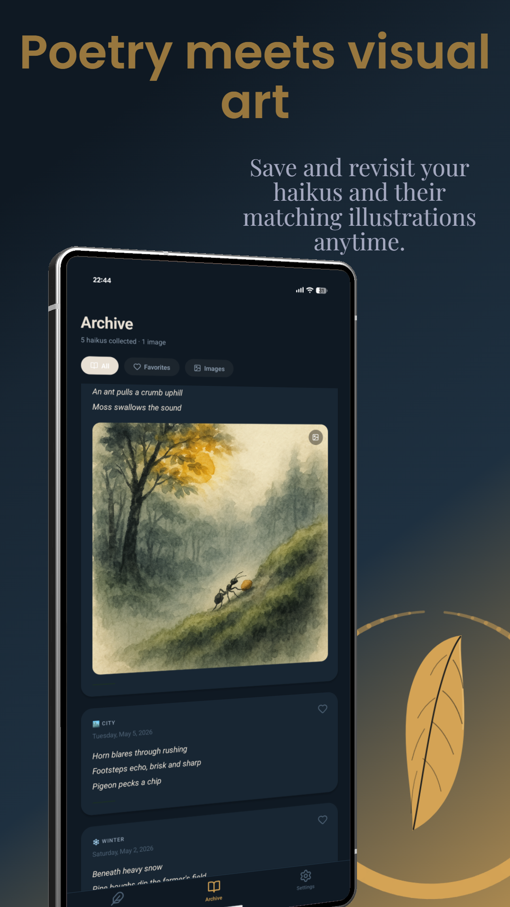

# Daily Haiku

A small mobile app that quietly delivers an original AI-composed haiku every morning. Each haiku is written for the current season or a theme you pick, in the spirit of Bashō, Buson, and Issa — and can be paired with an original ink-wash illustration generated from the verse itself.

Available on the App Store and Google Play. Web companion at [dailyhaiku.app](https://dailyhaiku.app).

## Screenshots

<p align="center">
  
  
  
  
  
  
  
  
</p>

## What it does

- **A fresh haiku each day** — generated overnight, delivered as a notification at a time you choose.
- **Themed prompts** — 17 seasonal and natural themes (spring, ocean, solitude, night, …), or write your own custom topic.
- **Original illustrations** — generate watercolour-style artwork for any haiku worth keeping, save to your photo library.
- **Personal archive** — heart the ones that move you, browse the image gallery, share to friends.
- **Four languages** — English, German, French, Spanish. The AI composes natively in your chosen language, drawing on each tradition's own haiku poets.
- **A credit-based generation model** — one free generation per day, additional generations via small consumable IAPs.

## Architecture

The app is a thin React Native client. Anything that costs money or could be tampered with happens server-side in Firebase Cloud Functions:

```
┌─────────────────┐                          ┌──────────────────────┐
│   Expo / RN     │  ──── callables ────▶   │   Cloud Functions    │
│   (iOS/Android) │      (europe-west3)      │   (europe-west3)     │
└────────┬────────┘                          └──────────┬───────────┘
         │                                              │
         │ Auth + Firestore subscriptions               │ OpenAI
         ▼                                              ▼
┌────────────────────────────────────────────────────────────────────┐
│                          Firebase                                   │
│  Auth · Firestore ("dailyhaiku" DB) · App Check · Secret Manager    │
└────────────────────────────────────────────────────────────────────┘
                              ▲
                              │ purchase events
                       ┌──────┴───────┐
                       │  RevenueCat  │
                       │     (IAP)    │
                       └──────────────┘
```

### Design choices worth pointing at

- **Server-enforced credit system.** Daily-free quotas and credit balances live in Firestore in a per-user document. Security rules block all client writes; only the Cloud Functions (via the Admin SDK) can mutate credit state. The client subscribes via `onSnapshot` and renders what it sees. A tampered client can't grant itself a generation.
- **Pre-spend with atomic refund.** Every generation call debits credits in a Firestore transaction *before* hitting OpenAI. If OpenAI throws, the same transaction refunds atomically. There's no "I was charged but got nothing" path.
- **Two models, one decision point.** Free-tier daily generations use `gpt-4o-mini`. Paid generations use `gpt-4o`. The Cloud Function makes the choice from the user's server-side state — the client doesn't get to pick the cheaper one.
- **Native multilingual generation.** Each of the four supported languages has its own system prompt, tuned for that language's haiku tradition. The model composes natively rather than translating from English.
- **Idempotent purchase webhook.** RevenueCat purchase events are deduplicated in a `processedTransactions` collection in Firestore, so credits land exactly once even when the webhook retries.
- **On-device image persistence.** Generated images are written to `Paths.document` as files; only the `file://` URI is kept in the archive metadata in AsyncStorage. Inlining base64 would blow past AsyncStorage's size limits as the archive grows.
- **Region-pinned function calls.** All callables are deployed and addressed in `europe-west3` to minimise latency for the app's primary audience and to keep request/response data in EU jurisdictions.

## Tech stack

- **App** — Expo SDK 54, React Native, React 19, TypeScript, Expo Router (file-based), React Query, AsyncStorage, `@nkzw/create-context-hook` for context providers
- **Backend** — Firebase Cloud Functions v2 (Node 20), Firebase Auth, Firestore (named DB), Firebase Secret Manager for API keys
- **AI** — OpenAI: `gpt-4o-mini` (free tier), `gpt-4o` (paid tier), `gpt-image-1` (illustration)
- **Payments** — RevenueCat consumable IAPs, with a Cloud Function webhook granting credits server-side
- **Auth providers** — Sign in with Apple (iOS), Google Sign-In (Android)
- **i18n** — Four languages typed against a shared `Translations` shape so missing keys are compile-time errors

## Project structure

```
app/                  Expo Router screens (today, archive, settings, modals)
providers/            Auth / Haiku / Purchase / Language context providers
utils/                Generation clients, error mapping, notifications
i18n/                 Translations (en / de / fr / es), typed against en.ts
constants/            Colour palette, haiku themes, legal documents
components/           Shared UI (LegalScreen, etc.)
lib/                  Firebase client init + App Check wiring
functions/            Cloud Functions source
  ├── generate-haiku.ts        free + paid generation
  ├── generate-image.ts        gpt-image-1 illustration
  ├── revenuecat-webhook.ts    purchase → credit grant
  ├── delete-account.ts        GDPR account deletion
  └── lib/user-doc.ts          credit transactions, daily-free reset
firestore.rules       Client-write-blocking security rules
plugins/              Custom Expo config plugin (Podfile modular headers)
```

## A note on the repo

This is a personal project. The source is published for reference and learning, but the App Store and Play Store builds are tied to my Firebase project, my OpenAI account, and my RevenueCat / store-listing accounts. The Firebase client config and platform-specific service files are kept out of this repo — running a local instance requires provisioning your own Firebase project, OpenAI key, and RevenueCat account.

Issues and pull requests are welcome but the project is not accepting feature contributions; it's primarily a snapshot of how a small, complete, store-shipped Expo + Firebase app fits together.
